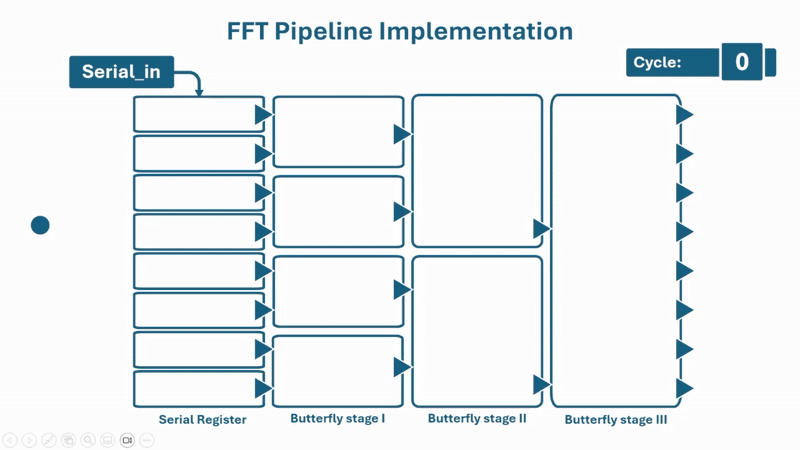

# 8-Point FFT Verilog Implementation

## Overview
This repository contains a Verilog implementation of an 8-point Fast Fourier Transform (FFT) system. The design includes a datapath, control unit, and testbench for verification.

  

## Project Structure
The project consists of the following modules:

### Core Modules:
- **BF1.v**: Basic butterfly unit 1.
- **BF2.v**: Basic butterfly unit 2.
- **BF4.v**: Basic butterfly unit 4.
- **FFT_3stage.v**: Implements the 3-stage FFT pipeline.
- **FFT_8p_control.v**: Control unit for managing FFT computation.
- **FFT_8p_control_2.v**: Alternate control unit implementation.
- **FFT_datapath.v**: Handles the computation for the FFT process.
- **FFT_top.v**: Top-level module integrating all components.
- **FFT_xn_ROM.v**: ROM module containing precomputed input test vectors.
- **s2p.v**: Serial-to-parallel conversion module.

### Testbench:
- **tb_FFT_top.v**: Testbench for validating the FFT implementation.

## Octave Scripts
The following scripts are included in `octave_scripts/` for testing, verification, and generating required data for the Verilog implementation:

- **FFT_8p_bf_3stage_v0.m**  
  Implements an 8-point FFT using a three-stage butterfly structure for verification. It compares the computed results with MATLAB’s `fft()` function and generates test vectors.

- **FFT_tstvec_gen_f_verilog_fft8p.m**  
  Generates random test vectors, computes their FFT, and stores the results in files (`FFT_oct_res_real.txt` and `FFT_oct_res_imag.txt`) for Verilog verification.

- **randomNumbers.m**  
  Function to generate N random numbers in the range [-5000, 5000], excluding values between [-100, 100], used for generating diverse test signals.

- **twid_hex.m**  
  Computes the twiddle factors for an 8-point FFT, scales them by \(2^{15}\), and outputs them as signed 16-bit hexadecimal numbers.

- **twidtobinfraction.m**  
  Converts twiddle factors into binary fractional representation with a user-defined precision (default: 12 bits).

- **testvecROM.txt**  
  Stores the generated test vectors in hexadecimal format, which are used as FFT inputs.

- **FFT_oct_res_real.txt**  
  Stores the real part of the FFT results in hexadecimal format.

- **FFT_oct_res_imag.txt**  
  Stores the imaginary part of the FFT results in hexadecimal format.

## Features
- Fully implemented in Verilog.
- Supports 8-point FFT computation.
- Uses a pipelined architecture for efficient processing.
- Includes Octave scripts for testing and vector generation.
- Designed for FPGA and ASIC synthesis.

## Simulation and Testing
1. Compile all Verilog files using a simulation tool such as ModelSim, Xilinx Vivado, or QuestaSim.
2. Run `tb_FFT_top.v` testbench to verify the functionality.
3. Observe the outputs for correctness and latency measurements.

## Usage
To integrate this FFT module into your project:
1. Include `FFT_top.v` as the primary FFT module.
2. Ensure proper clocking and reset sequences.
3. Feed input data serially through `s_in`.
4. Capture FFT outputs from `X_0_re, X_0_im, ... X_7_re, X_7_im`.

## Author
**Mohamed S. Helal**  
Date Created: March 9, 2025

## License
This project is released under the MIT License. Feel free to use and modify it as needed.
